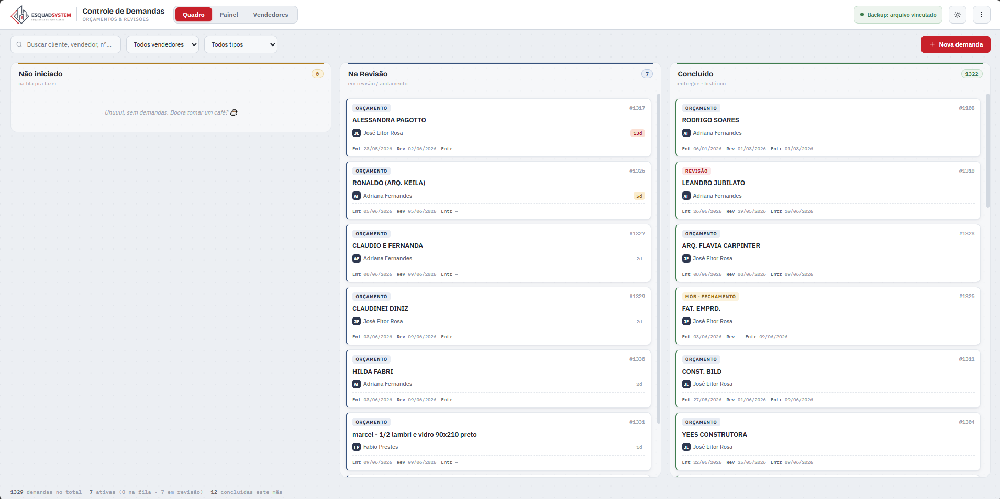
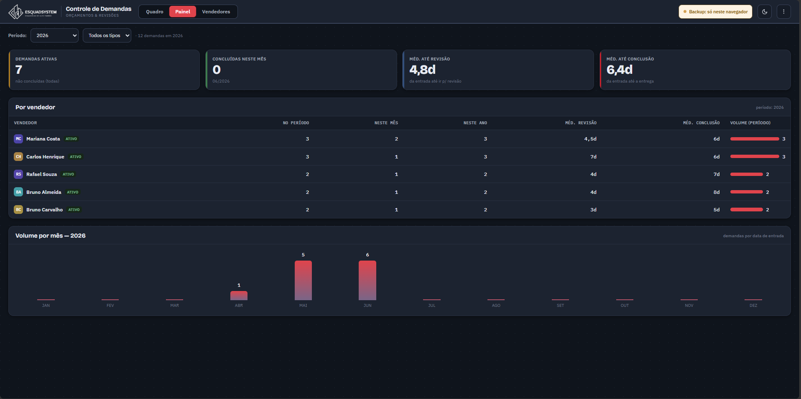
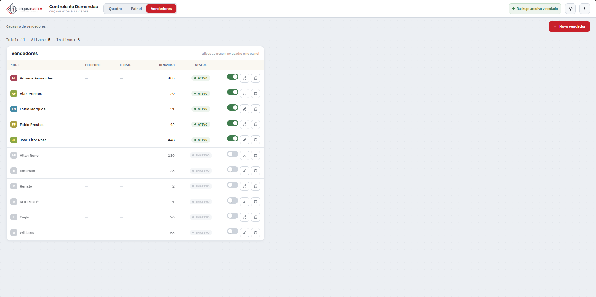

# Controle de Demandas — Kanban offline

> Kanban pessoal para acompanhamento de demandas (orçamentos e revisões) numa empresa de esquadrias de alumínio. Arquivo HTML único, funciona offline, com backup em arquivo real no disco via File System Access API.

[🔗 **Demo ao vivo**]( https://josegavioli.github.io/controle-demandas/) · [📄 Documentação completa](./docs/DOCUMENTACAO.md)




---

## O problema que resolve

Eu trabalho com revisão e finalização de orçamentos de esquadrias de alumínio. Os vendedores me mandam pedidos o dia inteiro, e eu precisava acompanhar três coisas: **o que entrou na fila, o que está em revisão e o que já foi entregue**.

Antes eu usava uma planilha Excel com um formulário em VBA. Funcionava, mas:
- O VBA quebrou depois de uma atualização do Office.
- A planilha não dava visão geral — só linhas e linhas.
- Não tinha como ver tempo médio por demanda, distribuição por vendedor, etc.
- Cadastrar uma demanda nova exigia abrir o formulário, sem feedback visual.

Construí esse app pra resolver exatamente o meu fluxo.

## O que faz

- **Kanban com três colunas** (Não iniciado / Na Revisão / Concluído) com drag-and-drop e carimbo automático de datas
- **Painel de indicadores** — demandas ativas, tempo médio até revisão, até conclusão, distribuição por vendedor, volume mensal/anual
- **Cadastro de vendedores** com ativar/desativar, renomeação em cascata e bloqueio de exclusão para vendedores com demandas vinculadas
- **Backup automático em arquivo real no disco** (File System Access API) — sobrevive a limpeza de cache do navegador
- **Tema claro/escuro** com persistência e respeito ao tema do sistema operacional
- **Histórico paginado** — a coluna de concluídos tem 1300+ registros sem travar o navegador
- **Busca global** que atravessa as três colunas

## Decisões técnicas que valem comentar

**Arquivo HTML único.** Sem build, sem framework, sem servidor. A escolha foi deliberada: usuário único, máquina única, e o requisito de funcionar 100% offline. JavaScript puro com variáveis CSS para tema. ~108 KB todo o app, incluindo dados embutidos e logo em base64.

**Persistência em duas camadas.** localStorage para velocidade no dia a dia, File System Access API para um arquivo real de backup que sobrevive à limpeza de cache. O handle do arquivo fica guardado em IndexedDB para reusar entre sessões. Isso resolve o problema clássico de apps offline perderem dados em manutenção do navegador.

**Cadastro de vendedores como entidade própria.** Inicialmente os "ativos" eram uma lista *hardcoded*. Refatorei para um registro separado quando ficou claro que dois vendedores compartilhavam o mesmo primeiro nome e estavam sendo confundidos no histórico. Renomear no cadastro propaga em cascata para todos os cartões vinculados.

**Tema escuro sem flash.** Um script mínimo no `<head>` aplica o `data-theme` antes do CSS pintar, lendo localStorage ou `prefers-color-scheme`. Tudo o que muda entre temas é variável CSS, então adicionar superfícies novas não exige tocar no JS do tema.

**Anti-padrão evitado: colisão de classes CSS.** Em um determinado momento a classe `.bar` foi usada para a barra superior do app E para as barrinhas de volume do painel — a regra das barrinhas vinha depois e pintava a barra superior de vermelho. Renomeei pra `.vbar` e documentei a regra. Pequeno, mas representa o tipo de cuidado que escala em projetos maiores.

## Tecnologias

- HTML, CSS, JavaScript (sem dependências)
- File System Access API
- IndexedDB
- localStorage
- Variáveis CSS para sistema de tema

## Como rodar

```bash
git clone https://github.com/JoseGavioli/controle-demandas
cd controle-demandas
# clique duplo em index.html — abre no navegador
```

Recomendado: **Chrome ou Edge** (o vínculo de arquivo de backup só funciona neles; em outros navegadores cai em download automático).

## Dados de demonstração

Este repositório contém apenas dados fictícios para demo. Em produção, o app gerencia ~1300 demandas reais de uma empresa de esquadrarias.

## Estrutura

```
.
├── index.html                # o app completo (CSS + JS embutidos)
├── docs/
│   └── DOCUMENTACAO.md       # documentação técnica e de usuário
└── assets/
    └── preview.png
    └── preview2.png
    └── preview3.png
```

## Licença

[MIT](./LICENSE) — use, modifique, distribua à vontade.

---

*Feito por [José Gavioli](https://github.com/JoseGavioli) para resolver um problema real.*
